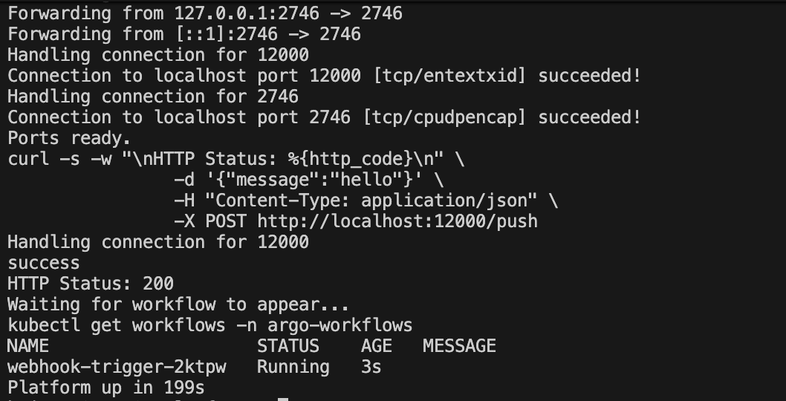

# Internal Developer Platform

> Full platform boots in under 5 minutes. One command.
```bash
make platform-up
```



---

## What Gets Built

`make platform-up` spins up a complete internal developer platform locally on kind. Four projects, one command:

- **[argo-event-pipeline](https://github.com/SmartBrisco/argo-event-pipeline)** - Event-driven CI/CD pipeline on Kubernetes using Argo Events and Argo Workflows, with Trivy security scanning and AI-powered failure analysis via Ollama
- **[platform-observability](https://github.com/SmartBrisco/platform-observability)** - Full-stack observability with OpenTelemetry, Jaeger, Prometheus, and Grafana receiving live telemetry from the Argo pipeline
- **[gitops-infra-pipeline](https://github.com/SmartBrisco/gitops-infra-pipeline)** - Multi-cloud GitHub Actions and Terraform pipeline with OPA policy gates across AWS, GCP, and Azure. OIDC authentication, parallel cloud deployment jobs, and multi-channel Slack notifications.
- **[namespace-provisioner](https://github.com/SmartBrisco/namespace-provisioner)** - Kubernetes operator for policy-enforced namespace provisioning with RBAC and resource quotas

The GitOps infrastructure pipeline runs automatically via GitHub Actions on push to main in that repo.

---

## Prerequisites

Install these before running anything, then run `make check-prereqs` to verify:

| Tool | Purpose |
|------|---------|
| [kubectl](https://kubernetes.io/docs/tasks/tools/) | Kubernetes CLI |
| [kind](https://kind.sigs.k8s.io/docs/user/quick-start/) | Local Kubernetes cluster |
| [argo CLI](https://argo-workflows.readthedocs.io/en/latest/walk-through/argo-cli/) | Argo Workflows CLI |
| [go](https://go.dev/doc/install) | Required to build and install the operator |
| [terraform](https://developer.hashicorp.com/terraform/install) | Infrastructure as code |
| [trivy](https://aquasecurity.github.io/trivy/latest/getting-started/installation/) | Security scanning |
| [conftest](https://www.conftest.dev/) | OPA policy testing |
| [helm](https://helm.sh/docs/intro/install/) | Required to install Kargo |
| [kargo CLI](https://github.com/akuity/kargo/releases/latest) | Kargo promotion CLI |

---

## Usage

### Spin up
```bash
git clone <this-repo>
cd platform
make platform-up
```

The Makefile handles everything:

1. Clones all four project repos
2. Creates a local kind cluster
3. Creates all required namespaces
4. Installs the ManagedNamespace CRD
5. Installs Argo Workflows and Argo Events
6. Applies RBAC
7. Deploys all manifests
8. Pulls the TinyLlama model into the cluster
9. Deploys the full observability stack
10. Port-forwards the webhook and Argo UI
11. Fires a test webhook and confirms the pipeline runs

### Access the UIs

After `make platform-up` completes:

| Service | URL |
|---------|-----|
| Argo UI | https://localhost:2746 |
| Webhook | http://localhost:12000/push |

To access the observability stack, port-forward separately:
```bash
kubectl port-forward svc/grafana 3000:3000 -n monitoring &
kubectl port-forward svc/prometheus 9090:9090 -n monitoring &
kubectl port-forward svc/jaeger-query 16686:16686 -n monitoring &
```

| Service | URL |
|---------|-----|
| Grafana | http://localhost:3000 (admin/admin) |
| Prometheus | http://localhost:9090 |
| Jaeger | http://localhost:16686 |

### Tear down
```bash
make teardown
```

Kills port-forwards and deletes the cluster.

---

## Terraform Validation (Optional)

For local validation of the GitOps infrastructure pipeline before pushing:
```bash
make tf-init       # Initialize Terraform across all three clouds
make tf-validate   # Format check and validate per cloud
make tf-scan       # Trivy IaC scan per cloud
make tf-policy     # OPA policy tests against AWS and GCP plan output
```

`tf-init`, `tf-validate`, and `tf-scan` run without credentials. `tf-policy` requires AWS credentials configured locally. The actual `terraform apply` runs automatically via GitHub Actions on push to main in `gitops-infra-pipeline`.

---

## One-Time Setup (GitOps Infrastructure Pipeline Only)

Required once before Terraform validation targets will work. Not required for `make platform-up`.

### AWS OIDC

Create an IAM OIDC Identity Provider:
```
Provider URL: https://token.actions.githubusercontent.com
Audience: sts.amazonaws.com
```

Create four scoped inline policies: `eks_access`, `ec2_vpc`, `SecretsManager`, `tfbackendstate`. No AWS managed FullAccess policies are used.

> This works with any cloud provider that supports OIDC federation with GitHub Actions. Replace the AWS-specific Terraform module and the rest of the platform stays the same.

### Slack Webhooks

Create a Slack app at [api.slack.com/apps](https://api.slack.com/apps). Enable Incoming Webhooks and create three webhooks pointed at:

- `#infra-deployments`
- `#infra-alerts`
- `#infra-audit`

### GitHub Secrets

Add to your fork of `gitops-infra-pipeline` under Settings → Secrets and variables → Actions:

| Secret | Value |
|--------|-------|
| `AWS_ROLE_ARN` | ARN of the IAM role created above |
| `SLACK_WEBHOOK_DEPLOYMENTS` | Webhook URL for deployments channel |
| `SLACK_WEBHOOK_ALERTS` | Webhook URL for alerts channel |
| `SLACK_WEBHOOK_AUDIT` | Webhook URL for audit channel |

---

## All Targets

| Target | Description |
|--------|-------------|
| `make check-prereqs` | Verify required tools are installed |
| `make clone` | Clone all four project repos |
| `make cluster-create` | Create the kind cluster |
| `make namespaces` | Create all required namespaces |
| `make operator-install` | Install the ManagedNamespace CRD |
| `make operator-run` | Run the operator locally (blocking) |
| `make operator-deploy-sample` | Apply a sample ManagedNamespace manifest |
| `make argo-install` | Install Argo Workflows |
| `make argo-event-install` | Install Argo Events and EventBus |
| `make apply-rbac` | Apply RBAC manifests |
| `make deploy-manifest` | Deploy Argo pipeline manifests |
| `make pull-tiny-llama-model` | Pull TinyLlama into the cluster |
| `make port-forwarding` | Port-forward webhook and Argo UI |
| `make run-test` | Fire a test webhook |
| `make deploy-jaeger` | Deploy Jaeger |
| `make deploy-prometheus` | Deploy Prometheus |
| `make deploy-grafana` | Deploy Grafana |
| `make deploy-otel` | Deploy OTel Collector |
| `make verify` | Verify all monitoring pods are running |
| `make tf-bootstrap` | Create S3 state bucket and DynamoDB lock table |
| `make tf-init` | Initialize Terraform across all three clouds |
| `make tf-validate` | Run fmt and validate across all three clouds |
| `make tf-scan` | Run Trivy IaC scan across all three clouds |
| `make tf-policy` | Run OPA policy tests against AWS and GCP plan output |
| `make kargo-install` | Install cert-manager and Kargo |
| `make kargo-login` | Port-forward and login to Kargo |
| `make kargo-setup` | Apply Kargo project, warehouse, and stages |
| `make kargo-promote-dev` | Promote freight to dev (FREIGHT=\<hash\>) |
| `make kargo-promote-prod` | Promote freight to prod (FREIGHT=\<hash\>) |
| `make platform-up` | Spin up the full platform |
| `make teardown` | Kill port-forwards and delete the cluster |